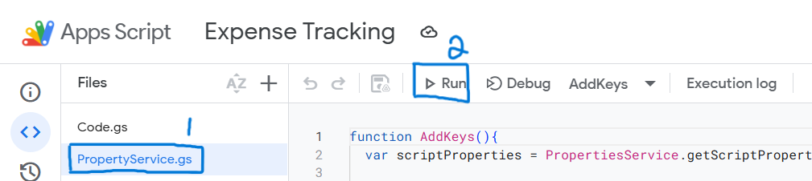
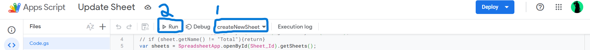

# Expense Tracker

## Introduction

This is an expense tracker utilising free software such as google sheet and google app script for apple users

### Prerequisites

- Google Account

### Creation of Scripts

1. Copy [Google Sheet](https://docs.google.com/spreadsheets/d/1ubyK8wVEwTyb_m3H7Mx2PJsOFY4h2O8FcVruWHgczRc/edit?usp=sharing)  template.

2. Create an [App Script](https://script.google.com/home/projects/create) with the following files.
    - Code\.gs (Created by default)
    - PropertyService\.gs
    > Note: *when prompted with HTML/Script, select __Script__.*

3. Copy contents of file in Repository and paste in the respective files.
    > Replace code if needed such as SHEET_ID in PropertyService\.gs

4. Run PropertyService\.gs to save the SHEET_ID for the script to use later.
    

### Automation Triggers

In Google App Script, we can create triggers to automate the creation of new Sheets for a new month. There are a few types of triggers:
1. Time-Based
2. From Calender

We will be automating two functions in our App Script

1. updateSheetNamesRow
2. createNewSheet

#### Steps

1. On the left navbar, select "Triggers" (Fourth one from the top).
2. Select "Add Trigger" (bottom right)
    1. updateSheetNamesRow
        - Choose which function to run
            - updateSheetNamesRow
        - Choose which deployment should run
            - Leave it as default
        - Select event source
            - Time-Driven
        - Select type of time based trigger
            - Day timer
        - Select time of day
            - Select the time you want it to update daily
    2. createNewSheet
        - Choose which function to run
            - updateSheetNamesRow
        - Choose which deployment should run
            - Leave it as default
        - Select event source
            - Time-Driven
        - Select type of time based trigger
            - Month timer
        Select day of month
            - 1st
        - Select time of day
            - Midnight to 1am

> If you are creating this in the middle of the month, run "createNewSheet" Function manually.
    - Follow the following image 

### Deployment

1. Select "Deploy" on the top right
2. Select "New Deployment"
    - Type: Web app
    - Who has access: Anyone

### IOS Shortcut

1. Download [Shortcut]("ExpenseTracker.shortcut") on IPhone
2. Click on Share > Open in Shortcut App
3. Select "Add Shortcut"

> Optional: Add shortcut to homescreen / Automation to run when Apple Pay is used.
