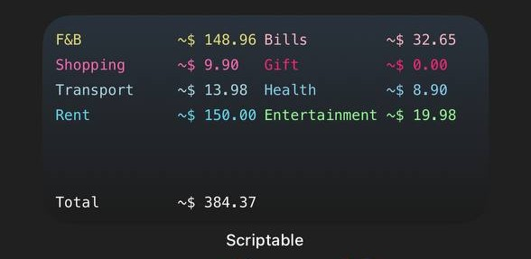
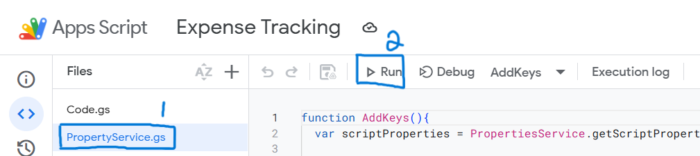
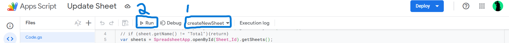
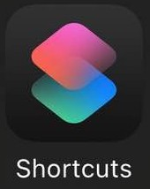
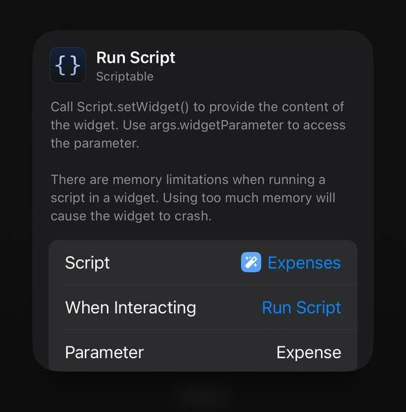

# Expense Tracker

## Introduction

This is an expense tracker utilizing free software such as google sheet and google app script for apple users. User can then view their expense on google sheet or as a widget on their device

1. Prerequisites
2. First Time Creation (If you created your scripts before, skip to step 3)
    1. Creation of Scripts
    2. Automation Triggers
    3. Deployment
    4. IOS Shortcuts
    5. Widget Creation
3. Update Current Version
    1. Open [App Script](https://script.google.com/home)
    2. Replace content of Code\.gs with new [Code.gs](./Code.gs)
    3. Click on Deploy > Manage Deployments > Edit  > Version > New Version > Deploy
    4. Update your script in Scriptable with the updated [scriptable.js](/scriptable.js)

### Prerequisites

- Google Account

### Creation of Scripts

1. Copy [Google Sheet](https://docs.google.com/spreadsheets/d/1ubyK8wVEwTyb_m3H7Mx2PJsOFY4h2O8FcVruWHgczRc/edit?usp=sharing) template.
    - you can add more categories if needed, Code is able to handle it dynamically. Remember to update shortcut when adding more categories.

2. Create an [App Script](https://script.google.com/home/projects/create) with the following files.

   - Code\.gs (Created by default)
   - PropertyService\.gs
     > Note: _when prompted with HTML/Script, select **Script**._

3. Copy contents of file in Repository and paste in the respective files.

   > Replace code if needed such as SHEET_ID in PropertyService\.gs

4. Run PropertyService\.gs to save the SHEET_ID for the script to use later.
   

### Automation Triggers

In Google App Script, we can create triggers to automate the creation of new Sheets for a new month. There are a few types of triggers:

1. Time-Based
2. From Calendar

We will be automating two functions in our App Script

1. updateSheetNamesRow
2. createNewSheet

#### Steps

1. On the left navbar, select "Triggers" (Fourth one from the top).
2. Select "Add Trigger" (bottom right)
   1. updateSheetNamesRow
      - Choose which function to run
        - updateSheetNamesRow
      - Choose which deployment should run
        - Leave it as default
      - Select event source
        - Time-Driven
      - Select type of time based trigger
        - Day timer
      - Select time of day
        - Select the time you want it to update daily
   2. createNewSheet
      - Choose which function to run
        - createNewSheet
      - Choose which deployment should run
        - Leave it as default
      - Select event source
        - Time-Driven
      - Select type of time based trigger - Month timer
        Select day of month - 1st
      - Select time of day
        - Midnight to 1am
3. Run createNewSheet to initialize a new sheet for current month
    - Follow the following image 
    > Sheets for upcoming months will be created automatically from the trigger created earlier.

### Deployment

1. Select "Deploy" on the top right
2. Select "New Deployment"
   - Type: Web app
   - Who has access: Anyone
3. copy URL for IOS shortcut later (**NOT** Library URL)

### IOS Shortcut

1. Download [Shortcut]("ExpenseTracker.shortcut") file onto your IPhone
2. Open Shortcut file
3. Click on Share  > Open in Shortcut App 
4. Select "Add Shortcut".
5. Replace the last action shortcut with the URL of the deployment created in the previous step.
6. After creating shortcut, click on share again on your newly created shortcut > Add to Home Screen

> You can add more options for your category if you have added more on your google sheet but remember to have the exact same naming format if not, it will not be able to work

### Widget

1. Download [Scriptable](https://apps.apple.com/us/app/scriptable/id1405459188)
2. Create a new Script and paste the content of scriptable.js into it
3. Add Scriptable widget (Medium Size) on your homescreen and select your new script as your script

