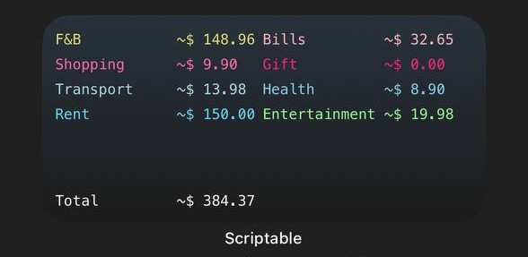
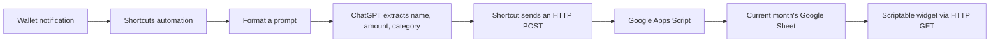
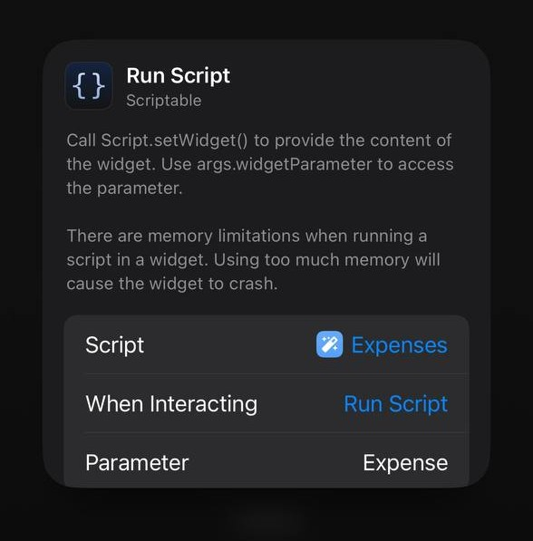

# Google Sheets Expense Tracker

Turn Wallet notifications into expense entries in Google Sheets. An iPhone automation reads the notification, formats it into a prompt for ChatGPT, and extracts the expense **name, amount, and category**. The shortcut then sends those fields to Google Apps Script, which records the expense in the current month's sheet.

View your spending in Google Sheets or in an optional Scriptable home screen widget.



## How it works


```mermaid
flowchart LR
    A[Wallet notification] --> B[Shortcuts automation]
    B --> C[Format a prompt]
    C --> D[ChatGPT extracts name, amount, category]
    D --> E[Shortcut sends an HTTP POST]
    E --> F[Google Apps Script]
    F --> G[Current month's Google Sheet]
    G --> H[Scriptable widget via HTTP GET]
```

The automation passes Wallet notification text to ChatGPT for extraction. Any notification supplied by the automation can be processed, but only a notification containing an identifiable expense should produce a new row. ChatGPT runs as part of the shortcut; the Apps Script backend receives the extracted fields.

**iOS trigger support:** Receiving notification text depends on the automation configured on your device. Apple's documented Wallet **Transaction** trigger runs when a selected card is tapped; it does not establish that every Wallet notification is available as shortcut input. Use your existing notification automation if it already supplies the text, or configure a supported transaction trigger and inspect the input it provides. See [Apple's transaction trigger guide](https://support.apple.com/guide/shortcuts/apd65c67538a/ios).

## What you need

- An iPhone running **iOS 27 or later** for the automated shortcut, with Wallet and Shortcuts and an automation that supplies notification text or transaction details.
- ChatGPT configured for use from your shortcut.
- A Google account with access to Google Sheets and Apps Script.
- An internet connection to process and save expenses.
- [Scriptable](https://apps.apple.com/us/app/scriptable/id1405459188), if you want the widget.

## Repository files

| File | Purpose |
| --- | --- |
| [Code.gs](./Code.gs) | Receives expenses, serves summary data, creates monthly tabs, and builds yearly summaries. |
| [AutomatedTracker.shortcut](./AutomatedTracker.shortcut) | Shortcut for the automated Wallet expense workflow. |
| [ExpenseTracker.shortcut](./ExpenseTracker.shortcut) | Shortcut for entering expenses manually. |
| [scriptable.js](./scriptable.js) | Displays the current month's category totals and overall total in a widget. |
| [Images](./Images/) | Setup screenshots and widget previews. |

## Setup

### 1. Copy the spreadsheet

1. Open the [Google Sheets template](https://docs.google.com/spreadsheets/d/1ubyK8wVEwTyb_m3H7Mx2PJsOFY4h2O8FcVruWHgczRc/edit?usp=sharing) and make your own copy.
2. Keep the `Template` tab: the script copies it to create each month's sheet.
3. Copy your spreadsheet ID from its URL:

   ```text
   https://docs.google.com/spreadsheets/d/YOUR_SPREADSHEET_ID/edit
   ```

The current script writes expense name, category, and amount to **columns A–C**, and reads category totals from **columns E–F**. Keep that layout and the template's formulas intact. The widget expects the last summary row to contain the overall total.

The Wallet prompt uses these seven categories: **F&B, Health, Shopping, Transport, Gift, Education, and Entertainment**. You can customize them, but the category names in the spreadsheet and the ChatGPT prompt must match exactly.

### 2. Configure Google Apps Script

1. Create a project in [Google Apps Script](https://script.google.com/home/projects/create).
2. Replace the default `Code.gs` contents with [Code.gs](./Code.gs) from this repository.
3. Replace `<SHEET_ID>` with your copied spreadsheet ID. The variable is currently spelled `SHEED_ID` in the code:

   ```javascript
   var SHEED_ID = "YOUR_SPREADSHEET_ID"
   ```

4. Save the project, select `createNewSheet`, and run it. Authorize access when prompted.
5. Confirm that a tab named for the current month, such as `September 2026`, appears in the spreadsheet.

The code uses Singapore time (`SGT`) to choose the current month and year. If you need a different time zone, update the `Utilities.formatDate` calls consistently and align the project's time zone with them.

Create the current month's tab before testing either endpoint. The current `doPost` and `doGet` handlers have a variable-shadowing issue when the tab is missing, so their automatic creation fallback does not complete the first request successfully.

### 3. Deploy the web app

1. Select **Deploy → New deployment → Web app**.
2. Set **Execute as** to yourself and **Who has access** to **Anyone** so the shortcut can call the endpoint without a Google sign-in step.
3. Deploy and copy the web app URL ending in `/exec`.

Use that URL in both the shortcut and the widget. The `/dev` test URL is limited to script editors; see [Google's web app deployment guide](https://developers.google.com/apps-script/guides/web).

The current backend has no authentication check. Anyone with its deployment URL can submit expenses and read the category summary. Use your own deployment URL and avoid publishing it.

### 4. Configure the shortcut and Wallet automation

**AutomatedTracker requires iOS 27 or later.**

1. Download [AutomatedTracker.shortcut](./AutomatedTracker.shortcut) to your iPhone, open it in Shortcuts, and add it.
2. Open the imported shortcut and replace the Apps Script URL in **Get Contents of URL** with your own deployed `/exec` URL. Use method **POST** and request body **Form**, with the field mapping below.
3. Connect your Wallet automation to **AutomatedTracker**. Check the imported actions and place the extraction steps below before the POST, either in the automation or in the shortcut. Pass the extracted dictionary to the shortcut if the automation performs the extraction.
4. In the **Text** action, insert the notification's **Subtitle** for the merchant name and **Body** for the amount, using the prompt below.
5. Pass **Text** to **Use ChatGPT**, then pass its **Response** to **Get Dictionary from**. Read `name`, `amount`, and `category` from the resulting dictionary and map them to the POST fields.
6. To reproduce the status message, add **Show Notification** with the title `Tracked` and body `name : amount`, inserting both dictionary values as variables. Place it after the submission, and check the sheet to confirm the expense was saved.
7. Test the flow with sample notification values, then test it through the Wallet automation on your device.

The notification fields used by the prompt are:

| Notification field | Prompt field | Extracted result |
| --- | --- | --- |
| **Subtitle** | `name` | Merchant name only |
| **Body** | `amount` | Transaction amount with currency symbols and surrounding text removed |
| Both fields, interpreted by ChatGPT | `category` | One of the seven allowed categories |

If you use Apple's **Transaction** trigger, select the relevant card and inspect the input it provides before mapping it to the prompt. The notification-based setup above requires access to **Subtitle** and **Body**.

For manual entry, use [ExpenseTracker.shortcut](./ExpenseTracker.shortcut) and configure its deployment URL separately. The bundled shortcuts are signed exports; verify their input variables and any **Run Shortcut** actions in Shortcuts, especially if you renamed an imported shortcut.

#### Wallet extraction prompt

Use this prompt in the **Text** action. `Notification (Subtitle)` and `Notification (Body)` below represent notification variables: insert the actual variables in Shortcuts instead of leaving them as literal text. Keep the category names identical to those in your spreadsheet.

```text
Categorise this expense into exactly one of these categories:
F&B
Health
Shopping
Transport
Gift
Education
Entertainment

name: Notification (Subtitle)
amount: Notification (Body)

For the name, return just the merchant name.
For the amount, extract the transaction amount, remove currency symbols and
other surrounding text, and format it with two decimal places (e.g. 12.50).

Return only a JSON dictionary with name, amount and category.
Do not include Markdown fences or any additional text.
```

For example, a subtitle of `Example Cafe` and a body of `You spent S$12.50` could return:

```json
{"name":"Example Cafe","amount":12.50,"category":"F&B"}
```

The extraction flow is **Text → Use ChatGPT → Get Dictionary from Response**. Use the resulting dictionary values in **Get Contents of URL** to save the expense, then display the `Tracked` notification.

Before posting, check that the dictionary contains a merchant name, a numeric amount, and one of the seven categories. Stop the shortcut if the response cannot be parsed or the fields are missing. A numeric value may display as `12.5` after parsing even if ChatGPT returns `12.50`; use number formatting wherever two decimal places need to be displayed.

#### Fields sent to Apps Script

| Extracted value | POST form field | Example | Sheet column |
| --- | --- | --- | --- |
| `name` | `Expense` | `Example Cafe` | A |
| `amount` | `Amount` | `12.50` | C |
| `category` | `Category` | `F&B` | B |

Field names are case-sensitive. Send **form fields**, not a raw JSON body: `doPost(e)` reads `e.parameter`. The JSON object above is the intermediate ChatGPT response, which the shortcut maps to those form fields.

The backend title-cases the expense name and saves the row in the month when the request is received. It does not store the notification's original timestamp or currency, or detect duplicate submissions.

### 5. Schedule monthly sheet creation

In Apps Script, open **Triggers → Add Trigger** and configure:

| Setting | Value |
| --- | --- |
| Function | `createNewSheet` |
| Deployment | Head |
| Event source | Time-driven |
| Trigger type | Month timer |
| Day | 1st |
| Time | Midnight–1 a.m., using the project's time zone |

Run `createNewSheet` manually once during setup. The scheduled trigger then prepares future months; requests arriving before the trigger runs can still encounter the missing-tab issue described above.

`updateSheetNamesRow` builds a `Total YYYY` summary and can be run manually or scheduled with a daily time-driven trigger. **Review it before enabling a recurring trigger:** the current implementation starts at the third tab and deletes tabs whose names contain neither the current year nor `Total`. Archive older monthly data before using it if you want to retain those tabs.

### 6. Add the optional widget

1. Install Scriptable and create a new script.
2. Paste in [scriptable.js](./scriptable.js).
3. Replace the existing `url` value at the top with **your own** deployment URL:

   ```javascript
   const url = "https://script.google.com/macros/s/YOUR_DEPLOYMENT_ID/exec"
   ```

4. Run the script once to check that it can load your data.
5. Add a **medium Scriptable widget** to your home screen and select that script in the widget's settings.

The widget reads the current month's E–F summary through `doGet`, displays categories in two columns, and shows the final summary row as `Total`. It uses a fixed dollar label and does not convert currencies.



## Check the complete flow

1. Confirm that the current month's spreadsheet tab exists.
2. Open your `/exec` URL in a browser. It should return JSON with a `data` array of category/amount pairs and a total as the final row.
3. Feed a sample notification into the shortcut and inspect the three extracted fields.
4. Submit it once and confirm that exactly one row appears in columns A–C and the category summary updates.
5. Test the Wallet automation with a real transaction, then check the sheet and widget. Remove the sample row when finished.

The sheet is the source of truth for whether a submission was saved: the current `doPost` does not return a structured success response. Check the sheet before retrying a request that reported an error, since a retry can create a duplicate.

## Updating an existing setup

1. Replace your Apps Script code with the current [Code.gs](./Code.gs), preserving your spreadsheet ID and any intentional time-zone changes.
2. Select **Deploy → Manage deployments → Edit → Version → New version → Deploy** to update the existing deployment.
3. If you create a different deployment instead, replace the URL in both the shortcut and Scriptable.
4. Update **AutomatedTracker** and its Wallet automation together: check the prompt, dictionary values, category list, and any **Run Shortcut** references after renaming or importing. Keep the POST field names `Expense`, `Amount`, and `Category` unchanged.
5. Replace the widget script with the current [scriptable.js](./scriptable.js), then restore your own deployment URL.
6. Repeat the checks above after updating.

## Troubleshooting

| Symptom | What to check |
| --- | --- |
| Automation does not run or receives empty input | Check the selected Wallet trigger/card and inspect the input on your device. A card-tap trigger does not guarantee access to every Wallet notification. |
| ChatGPT output cannot be parsed | Check the response before posting; align the prompt's output format with the parser and handle `null` or invalid results. |
| No expense appears | Verify the `/exec` URL, access settings, POST form fields, spreadsheet ID, and Apps Script execution logs. |
| A request fails at the start of a month | Run `createNewSheet`, confirm the tab exists, and check the monthly trigger. |
| An expense appears twice | Check for overlapping automations or a retried request. The backend does not deduplicate entries. |
| Category total is wrong | Match the extracted category to the spreadsheet's spelling and check the template formulas. |
| Widget cannot load data | Open the endpoint and check for a `data` array, numeric totals, and a final total row; confirm Scriptable uses your URL. |
| Code changes have no effect | Deploy a new version of the existing web app after saving. |
